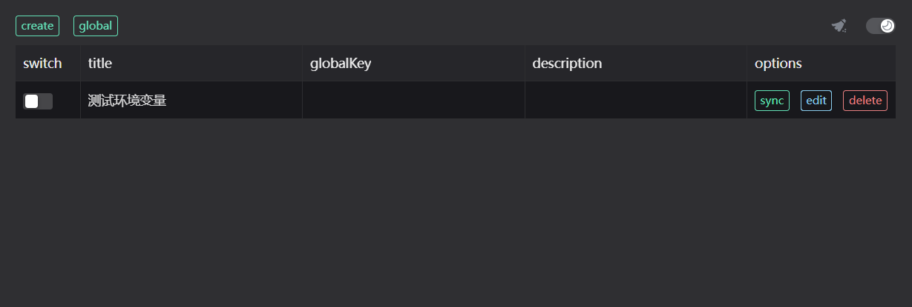
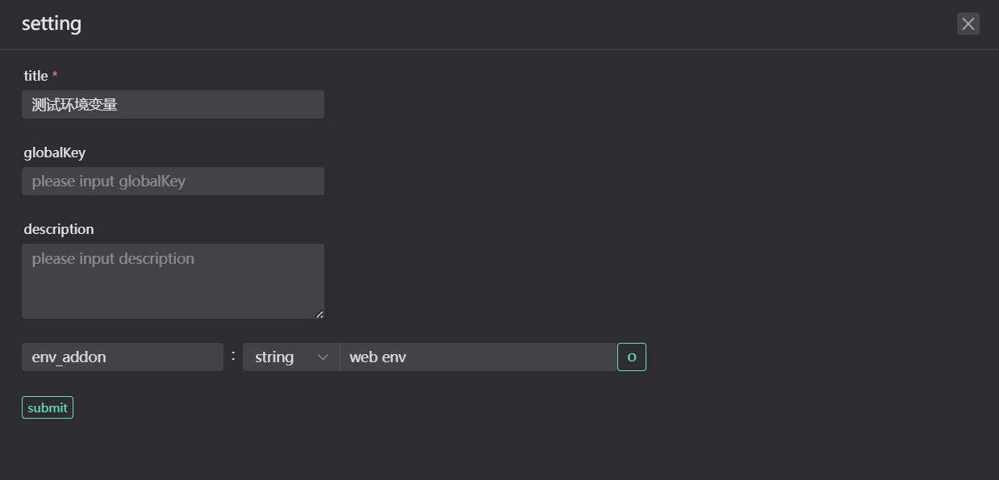
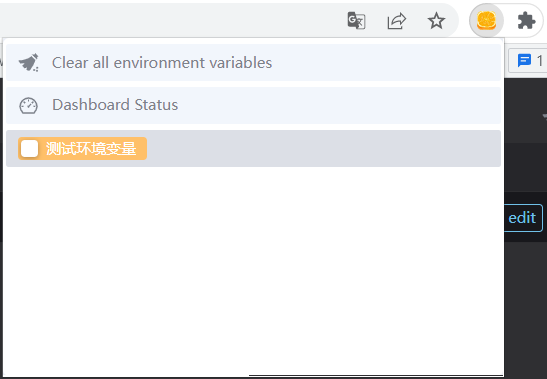
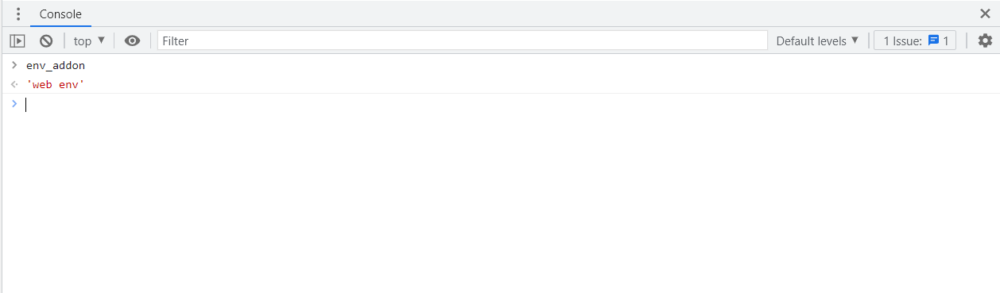

# Web Env

> Chrome 或 基于 Chromium 内核的环境变量浏览器拓展。

A tool to easily define browser environment variables

一个可以轻松定义浏览器环境变量的工具

1. dynamically add custom properties of window
2. Support multi-level settings
3. micro dial display
4. One click to switch variables

功能

1. 动态添加 window 的自定义属性
2. 支持多级设置
3. 微型表盘显示
4. 一键切换变量

## 使用效果

打开开发者工具,Tab 栏切换到 Web Env

### Devtool

### Settings

### Panel

### Console

